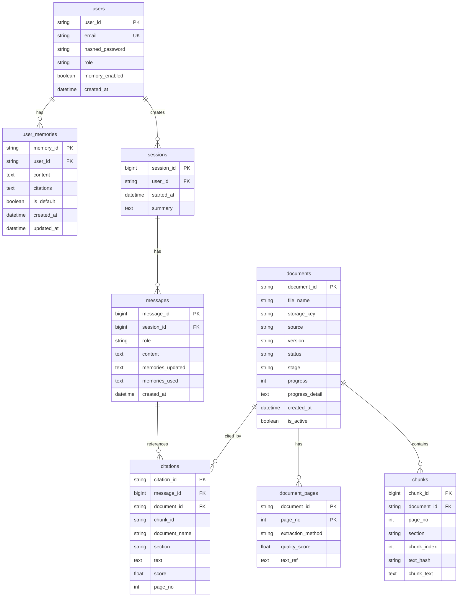

# MediMei — Architecture & Class Diagrams

## 1. System Architecture (High-Level)

```
┌─────────────────────────────────────────────────────────────────────────┐
│                           FRONTEND (React + Vite)                       │
│                                                                         │
│  ┌──────────┐  ┌──────────┐  ┌──────────┐  ┌──────────┐  ┌──────────┐ │
│  │ ChatPage │  │Documents │  │ComparePg │  │ MemoryPg │  │ Home/Auth│ │
│  └────┬─────┘  └────┬─────┘  └────┬─────┘  └────┬─────┘  └────┬─────┘ │
│       │              │              │              │              │      │
│  ┌────┴──────────────┴──────────────┴──────────────┴──────────────┴──┐  │
│  │                    Context Providers                               │  │
│  │  AuthContext │ ChatContext │ DocumentContext │ TaskContext │ ...  │  │
│  └───────────────────────────┬─────────────────────────────────────────┘  │
│                              │                                           │
│  ┌───────────────────────────┴─────────────────────────────────────────┐  │
│  │                       API Layer (apiFetch)                           │  │
│  │  auth.ts │ chat.ts │ documents.ts │ memories.ts │ sessions.ts │ ...│  │
│  └───────────────────────────┬─────────────────────────────────────────┘  │
└──────────────────────────────┼───────────────────────────────────────────┘
                               │  HTTP / REST (JSON)
                               ▼
┌─────────────────────────────────────────────────────────────────────────┐
│                    BACKEND (FastAPI + Uvicorn)                          │
│                                                                         │
│  ┌───────────────────────────────────────────────────────────────────┐  │
│  │                        API Router Layer                            │  │
│  │  /auth │ /chat │ /sessions │ /documents │ /memories │ /compare │  │  │
│  │  /search │ /citations │ /tasks                                    │  │
│  └───────────────────────────┬───────────────────────────────────────┘  │
│                              │                                           │
│  ┌───────────────────────────┴───────────────────────────────────────┐  │
│  │                      Service Layer                                 │  │
│  │                                                                    │  │
│  │  ┌─────────────┐  ┌──────────────┐  ┌──────────────────────────┐  │  │
│  │  │ RAGService  │  │ MemoryService│  │ ComparisonService        │  │  │
│  │  └──────┬──────┘  └──────┬───────┘  └──────────────────────────┘  │  │
│  │         │                │                                          │  │
│  │  ┌──────┴──────┐  ┌──────┴───────┐  ┌────────────┐  ┌──────────┐ │  │
│  │  │LLMService   │  │EmbeddingSvc  │  │ PDF Pipeline│  │ Chunker  │ │  │
│  │  │PromptBuilder│  │(BGE-M3)      │  │ (extract→   │  │(1000/200)│ │  │
│  │  │CitationMap  │  │              │  │  clean→OCR→ │  └──────────┘ │  │
│  │  │GroundingVal │  └──────────────┘  │  section)   │                │  │
│  │  └─────────────┘                    └────────────┘                │  │
│  │                                                                    │  │
│  │  ┌─────────────────────────────────────────────────────────────┐  │  │
│  │  │              Retrieval Layer                                 │  │  │
│  │  │  HybridSearch │ SemanticSearch │ KeywordSearch │ Reranker   │  │  │
│  │  └─────────────────────────────────────────────────────────────┘  │  │
│  │                                                                    │  │
│  │  ┌─────────────────────────────────────────────────────────────┐  │  │
│  │  │              Validation Layer (ProofChain)                   │  │  │
│  │  │  EvidenceValidator │ ClaimValidator │ CitationValidator     │  │  │
│  │  │  SafetyValidator   │ GroundingValidator                      │  │  │
│  │  └─────────────────────────────────────────────────────────────┘  │  │
│  └───────────────────────────────────────────────────────────────────┘  │
│                              │                                           │
│  ┌───────────────────────────┴───────────────────────────────────────┐  │
│  │                   Data Access Layer                                │  │
│  │  SQLAlchemy ORM Models │ QdrantRepository │ Dependencies           │  │
│  └───────┬───────────────────────┬───────────────────────────────────┘  │
└──────────┼───────────────────────┼───────────────────────────────────────┘
           │                       │
           ▼                       ▼
  ┌────────────────┐     ┌──────────────────┐    ┌─────────────────┐
  │   MySQL/MariaDB │     │  Qdrant Vector   │    │  Local LLM      │
  │  (SQLAlchemy    │     │  Database        │    │  (Qwen 3.5 4B   │
  │   Async Engine) │     │  (Cosine, 1024d) │    │   Q4_K_M GGUF)  │
  └────────────────┘     └──────────────────┘    └─────────────────┘
                                                         │
                                                  ┌──────────────────┐
                                                  │  BGE-M3 Model    │
                                                  │  (SentenceTrans. │
                                                  │   1024-dim embed)│
                                                  └──────────────────┘
```

---

## 2. Backend Class Diagram

```mermaid
classDiagram
    direction TB

    %% ===== MODELS (SQLAlchemy ORM) =====
    class User {
        +String user_id PK
        +String email
        +String hashed_password
        +String role
        +Boolean memory_enabled
        +DateTime created_at
    }

    class UserMemory {
        +String memory_id PK
        +String user_id FK
        +Text content
        +Text citations
        +Boolean is_default
        +DateTime created_at
        +DateTime updated_at
    }

    class Document {
        +String document_id PK
        +String file_name
        +String storage_key
        +String source
        +String version
        +String status
        +String stage
        +Integer progress
        +Text progress_detail
        +DateTime created_at
        +Boolean is_active
    }

    class DocumentPage {
        +String document_id PK
        +Integer page_no PK
        +String extraction_method
        +Float quality_score
        +Text text_ref
    }

    class Chunk {
        +BigInteger chunk_id PK
        +String document_id FK
        +Integer page_no
        +String section
        +Integer chunk_index
        +String text_hash
        +Text chunk_text
    }

    class ChatSession {
        +BigInteger session_id PK
        +String user_id FK
        +DateTime started_at
        +Text summary
    }

    class ChatMessage {
        +BigInteger message_id PK
        +BigInteger session_id FK
        +String role
        +Text content
        +Text memories_updated
        +Text memories_used
        +DateTime created_at
    }

    class CitationModel {
        +String citation_id PK
        +BigInteger message_id FK
        +String document_id FK
        +String chunk_id
        +String document_name
        +String section
        +Text text
        +Float score
        +Integer page_no
    }

    User "1" --> "many" UserMemory : has
    User "1" --> "many" ChatSession : creates
    Document "1" --> "many" DocumentPage : has
    Document "1" --> "many" Chunk : contains
    ChatSession "1" --> "many" ChatMessage : has
    ChatMessage "1" --> "many" CitationModel : references
    Document "1" --> "many" CitationModel : cited_by

    %% ===== API ROUTES =====
    class AuthRouter {
        +post_register
        +post_login
        +get_me
    }

    class ChatRouter {
        +post_chat_message
        +list_sessions
        +create_session
        +get_session
    }

    class DocumentsRouter {
        +get_documents
        +upload_document
        +delete_document
        +get_document_pages
    }

    class MemoriesRouter {
        +get_memories
        +create_memory
        +delete_memory
        +clear_memories
        +toggle_memory
    }

    class CompareRouter {
        +compare_documents
        +get_saved_comparisons
    }

    class SearchRouter {
        +search
    }

    class TasksRouter {
        +cancel_task
    }

    %% ===== CHAT / RAG SERVICES =====
    class RAGService {
        -SemanticSearchService search_service
        -EvidenceContextBuilder context_builder
        -PromptBuilder prompt_builder
        -LLMService llm_service
        -CitationMapper citation_mapper
        -GroundingValidator grounding_validator
        +ask question Dict
        +answer_with_evidence question evidence Dict
    }

    class ConversationService {
        +process_chat request ChatResponse
        -mock_evidence_retrieval query doc_ids
    }

    class MemoryService {
        -LLMService llm_service
        +get_memories_as_string user_id str
        +get_memories_as_records user_id List
        +extract_and_update_memories user_id msg answer List
        +ensure_default_memory user_id
        +save_qa_to_memory user_id question answer
    }

    class QueryRouter {
        +CATEGORY_KEYWORDS Dict
        +classify query str
        +get_section_boosts category List
    }

    class CitationMapper {
        +extract_citations answer citation_map Tuple
        -clean_markers text str
    }

    class EvidenceContextBuilder {
        +build results str
        +citation_map Dict
    }

    class GroundingValidator {
        +validate answer evidence bool
    }

    %% ===== LLM SERVICES =====
    class LLMService {
        -client LLMClient
        +generate_async prompt str
        +generate prompt str
        -extract_text response str
        -stream_generate prompt AsyncIterator
    }

    class PromptBuilder {
        +build system memories evidence question str
    }

    class LlamaCppClient {
        +generate prompt str
        -n_ctx int
        -n_gpu_layers int
    }

    class Gpt4AllClient {
        +generate prompt str
        -device str
    }

    class CTransformersClient {
        +generate prompt str
    }

    class MockLLMClient {
        +generate prompt str
    }

    %% ===== EMBEDDING SERVICES =====
    class EmbeddingService {
        -model SentenceTransformer
        +embed_query text List
        +embed_texts texts List
        +vector_size int
        +model_info Dict
    }

    %% ===== PDF PIPELINE =====
    class PDFPipeline {
        +process_pdf file_path document_id Dict
    }

    class PDFExtractor {
        +extract_pdf_pages file_path doc_id List
    }

    class OCRService {
        +run_ocr image str
    }

    class Cleaner {
        +clean_text text str
    }

    class SectionDetector {
        +detect_section text str
    }

    class QualityChecker {
        +check text QualityResult
    }

    class ChunkBuilder {
        +build_chunks text chunk_size overlap List
    }

    class Chunker {
        +create_chunks text doc_id page_no List
    }

    %% ===== RETRIEVAL SERVICES =====
    class HybridSearch {
        +hybrid_search query doc_ids limit List
    }

    class SemanticSearch {
        +semantic_search query doc_ids limit List
    }

    class KeywordSearch {
        +keyword_search query doc_ids limit List
    }

    class Reranker {
        +rerank_documents query docs top_k List
        -CrossEncoder model
    }

    class SemanticSearchService {
        +search query doc_ids top_k List
    }

    class IndexerService {
        +index_document doc_id chunks db
    }

    %% ===== VALIDATION SERVICES =====
    class EvidenceValidator {
        +validate_evidence chunks query bool
    }

    class ClaimValidator {
        +validate_claims answer evidence bool
    }

    class CitationValidator {
        +validate_citations answer citations bool
    }

    class SafetyValidator {
        +validate_safety answer query bool
    }

    %% ===== REPOSITORY =====
    class QdrantRepository {
        -AsyncQdrantClient client
        -int vector_size
        +ensure_collection_exists vector_size
        +add_chunks chunks
        +search query_vector limit doc_ids List
        +delete_by_document doc_id
        +set_vector_size size
    }

    %% ===== DEPENDENCIES =====
    class EmbeddingsDependency {
        +get_embedding_model SentenceTransformer
        +get_embedding_dimension int
    }

    class LLMDependency {
        +load_llm_client LLMClient
    }

    class QdrantDependency {
        +get_qdrant_client AsyncQdrantClient
    }

    class AuthDependency {
        +get_current_user User
    }

    %% ===== CORE =====
    class Config {
        +String EMBEDDING_MODEL
        +String LLM_MODEL
        +String LLM_MODEL_PATH
        +int LLM_N_CTX
        +float LLM_TEMPERATURE
        +int LLM_MAX_NEW_TOKENS
        +String QDRANT_URL
        +String QDRANT_COLLECTION
        +int TOP_K
        +float MIN_RELEVANCE_SCORE
    }

    class TaskManager {
        +register_task task_id type
        +cancel_task task_id
        +raise_if_cancelled task_id
    }

    class Security {
        +create_access_token subject role str
        +verify_password plain hashed bool
        +get_password_hash plain str
    }

    %% ===== RELATIONSHIPS =====
    RAGService --> LLMService : uses
    RAGService --> PromptBuilder : uses
    RAGService --> CitationMapper : uses
    RAGService --> GroundingValidator : uses
    RAGService --> EvidenceContextBuilder : uses
    RAGService --> SemanticSearchService : uses

    MemoryService --> LLMService : uses

    HybridSearch --> SemanticSearch : calls
    HybridSearch --> KeywordSearch : calls

    SemanticSearch --> EmbeddingService : uses
    SemanticSearch --> QdrantRepository : searches

    KeywordSearch --> QdrantRepository : scrolls

    IndexerService --> EmbeddingService : embeds
    IndexerService --> QdrantRepository : indexes

    PDFPipeline --> PDFExtractor : extracts
    PDFPipeline --> Cleaner : cleans
    PDFPipeline --> OCRService : OCR fallback
    PDFPipeline --> SectionDetector : detects
    PDFPipeline --> QualityChecker : checks
    PDFPipeline --> ChunkBuilder : builds chunks

    Chunker --> EmbeddingService : embeds
    Chunker --> QdrantRepository : indexes

    EmbeddingService --> EmbeddingsDependency : loads model
    LLMService --> LLMDependency : loads client
    LLMDependency --> LlamaCppClient : priority 1
    LLMDependency --> Gpt4AllClient : priority 2
    LLMDependency --> CTransformersClient : priority 3
    LLMDependency --> MockLLMClient : fallback
    QdrantRepository --> QdrantDependency : connects

    ConversationService --> QueryRouter : classifies
    ConversationService --> HybridSearch : retrieves
    ConversationService --> EvidenceValidator : validates
    ConversationService --> ClaimValidator : validates
    ConversationService --> CitationValidator : validates
    ConversationService --> SafetyValidator : validates

    ChatRouter --> RAGService : calls
    ChatRouter --> MemoryService : calls
    ChatRouter --> ConversationService : calls
    DocumentsRouter --> PDFPipeline : calls
    DocumentsRouter --> Chunker : calls
    DocumentsRouter --> IndexerService : calls
    MemoriesRouter --> MemoryService : calls
    SearchRouter --> SemanticSearchService : calls
```



---

## 3. Frontend Class Diagram

```mermaid
classDiagram
    direction TB

    %% ===== CONTEXT PROVIDERS =====
    class AuthContext {
        +UserProfile user
        +String token
        +Boolean loading
        +login(email, password) Promise
        +register(email, password) Promise
        +logout() void
        +updateUser(fields) void
    }

    class ChatContext {
        +ChatMessage[] messages
        +Boolean isLoading
        +sendMessage(content, documentIds) void
        +clearChat() void
        +Citation selectedCitation
        +Citation[] activeCitations
    }

    class ConversationContext {
        +Conversation[] conversations
        +String activeConversationId
        +setActiveConversationId(id) void
        +setConversations(updater) void
    }

    class DocumentContext {
        +Document[] documents
        +fetchDocuments() Promise
        +uploadDocument(file) Promise
        +deleteDocument(id) Promise
    }

    class TaskContext {
        +Task currentTask
        +startTask(type, payload, fn) Promise
        +cancelTask(id) void
    }

    class ThemeContext {
        +Theme theme
        +toggleTheme() void
    }

    class UIContext {
        +Boolean sidebarOpen
        +toggleSidebar() void
    }

    %% ===== PAGES =====
    class ChatPage {
        render ChatWindow + PromptBar + EvidencePanel
    }

    class DocumentsPage {
        render DocumentList + UploadZone
    }

    class ComparePage {
        render DocumentSelector + ComparisonSummary
    }

    class MemoryPage {
        +UserMemory[] memories
        +fetchMemories() void
        +handleAddMemory(content) void
        +handleDeleteMemory(id) void
        +handleToggleMemory() void
        +handleClearAll() void
        render MemoryItemCard[] + Toggle + Search
    }

    class HomePage {
        render LandingHero
    }

    class SignInPage {
        +email, password
        +handleSubmit() void
    }

    class SignUpPage {
        +email, password
        +handleSubmit() void
    }

    %% ===== API LAYER =====
    class APIClient {
        +apiFetch(path, options) Promise~T~
        -formatErrorDetail(detail) String
    }

    class AuthAPI {
        +loginRequest(email, password) TokenResponse
        +registerRequest(email, password) UserProfile
        +getMeRequest() UserProfile
    }

    class ChatAPI {
        +sendChatMessage(req, signal) ChatResponse
    }

    class SessionsAPI {
        +createSession(title, signal) Session
        +getSession(id) SessionDetail
        +listSessions() Session[]
    }

    class DocumentsAPI {
        +getDocuments() Document[]
        +uploadDocument(file) UploadResponse
        +deleteDocument(id) void
        +getDocumentPages(id) Page[]
    }

    class MemoriesAPI {
        +getMemoriesRequest() UserMemory[]
        +createMemoryRequest(content) UserMemory
        +deleteMemoryRequest(id) void
        +clearMemoriesRequest() void
        +toggleMemoryRequest(enabled) Object
    }

    class CompareAPI {
        +compareDocuments(req) Comparison
        +getSavedComparisons() Comparison[]
    }

    %% ===== HOOKS =====
    class useChat {
        +messages, sendMessage, clearChat
        +selectedCitation, activeCitations
    }

    class useAuth {
        +user, login, logout, updateUser
    }

    class useConversations {
        +conversations, activeConversationId
    }

    class useDocuments {
        +documents, fetchDocuments
    }

    class useTask {
        +currentTask, startTask, cancelTask
    }

    class useTheme {
        +theme, toggleTheme
    }

    class useUpload {
        +uploadFile(file) Promise
    }

    class useVoiceInput {
        +isListening, transcript
        +startListening() void
        +stopListening() void
    }

    class useSavedComparisons {
        +comparisons, saveComparison, deleteComparison
    }

    %% ===== TYPES =====
    class ChatMessage {
        +String id
        +String role
        +String content
        +Citation[] citations
        +String status
        +String memoriesUpdated
        +String memoriesUsed
    }

    class Citation {
        +String citationId
        +String documentId
        +String documentName
        +Number page
        +String section
        +String text
        +Number score
    }

    class Document {
        +String document_id
        +String file_name
        +String status
        +Integer progress
        +Boolean is_active
    }

    class UserMemory {
        +String memory_id
        +String user_id
        +String content
        +String created_at
        +String updated_at
    }

    %% ===== RELATIONSHIPS =====
    AuthContext --> AuthAPI : uses
    ChatContext --> ChatAPI : uses
    ChatContext --> SessionsAPI : uses
    DocumentContext --> DocumentsAPI : uses
    MemoryPage --> MemoriesAPI : uses
    ComparePage --> CompareAPI : uses

    useChat --> ChatContext : consumes
    useAuth --> AuthContext : consumes
    useConversations --> ConversationContext : consumes
    useDocuments --> DocumentContext : consumes
    useTask --> TaskContext : consumes
    useTheme --> ThemeContext : consumes

    ChatPage --> useChat : uses
    MemoryPage --> useAuth : uses
    MemoryPage --> MemoriesAPI : calls
```



---

## 4. RAG Pipeline Sequence (Chat Flow)

```
User sends message
       │
       ▼
┌──────────────┐
│ ChatRouter   │  POST /chat
│ (chat.py)    │
└──────┬───────┘
       │
       ├─► 1. Validate session (MySQL)
       │
       ├─► 2. MemoryService.ensure_default_memory()
       │    MemoryService.get_memories_as_records()
       │    (MySQL → user_memories table)
       │
       ├─► 3. Check memory match (exact + semantic)
       │    If match → return cached answer immediately
       │
       ├─► 4. EmbeddingService.encode(query)
       │    (BGE-M3 → 1024-dim vector)
       │
       ├─► 5. QdrantRepository.search()
       │    (Cosine similarity in Qdrant)
       │    Fallback: mock_evidence_retrieval (MySQL chunks)
       │
       ├─► 6. RAGService.answer_with_evidence()
       │    │
       │    ├─► EvidenceContextBuilder.build()
       │    │   (tagged evidence sections: S1, S2, ...)
       │    │
       │    ├─► PromptBuilder.build()
       │    │   (system + memories + evidence + question)
       │    │
       │    ├─► LLMService.generate_async()
       │    │   (Qwen 3.5 4B Q4_K_M via llama-cpp/gpt4all)
       │    │
       │    ├─► CitationMapper.extract_citations()
       │    │   (parse [S1], [S2] markers → citation metadata)
       │    │
       │    └─► GroundingValidator.validate()
       │       (check answer is grounded in evidence)
       │
       ├─► 7. MemoryService.extract_and_update_memories()
       │    (LLM analyzes conversation → ADD/REMOVE memories)
       │
       ├─► 8. MemoryService.save_qa_to_memory()
       │    (Store Q&A pair with citations for future matching)
       │
       ├─► 9. Save ChatMessage + Citations to MySQL
       │
       └─► 10. Return ChatResponse
              {answer, grounded, citations, memories_updated, memories_used}
```

---

## 5. PDF Ingestion Pipeline

```
User uploads PDF
       │
       ▼
┌──────────────────┐
│ DocumentsRouter   │  POST /documents/upload
└────────┬─────────┘
         │
         ▼
┌──────────────────┐
│ PDFPipeline       │  process_pdf(file_path, document_id)
│ (pipeline.py)    │
└────────┬─────────┘
         │
    ┌────┴────┬──────────┬──────────────┬──────────────┐
    ▼         ▼          ▼              ▼              ▼
┌────────┐ ┌───────┐ ┌─────────┐ ┌──────────┐ ┌────────────┐
│Extract │ │Cleaner│ │OCRService│ │SectionDet│ │QualityCheck│
│Pages   │ │       │ │(fallback)│ │          │ │            │
└────────┘ └───┬───┘ └─────────┘ └──────────┘ └────────────┘
               │
               ▼
      ┌────────────────┐
      │ ChunkBuilder    │  1000 chars, 200 overlap
      │ (chunk_builder) │
      └───────┬────────┘
              │
              ▼
      ┌────────────────┐
      │ Chunker         │  create_chunks()
      │ (chunker.py)    │  → Save chunks to MySQL
      └───────┬────────┘
              │
              ▼
      ┌────────────────┐
      │ EmbeddingService│  BGE-M3 encode (batch=32)
      │                 │  1024-dim normalized vectors
      └───────┬────────┘
              │
              ▼
      ┌──────────────────┐
      │ QdrantRepository  │  add_chunks() → Qdrant
      │                  │  Collection: drug_documents
      │                  │  Distance: Cosine
      └──────────────────┘
```

---

## 6. Database ER Diagram



---

## 7. Technology Stack Summary

| Layer | Technology |
|---|---|
| **Frontend** | React 18, Vite, TypeScript, TailwindCSS, React Router, Lucide Icons, Sonner (toasts) |
| **Backend** | FastAPI, Uvicorn, SQLAlchemy (async), Pydantic v2, Python-JOSE (JWT) |
| **Database** | MySQL / MariaDB (via SQLAlchemy async engine) |
| **Vector DB** | Qdrant (cosine distance, 1024-dim, collection `drug_documents`) |
| **Embedding** | BGE-M3 (`BAAI/bge-m3`, SentenceTransformer, 1024-dim, normalized) |
| **LLM** | Qwen 3.5 4B Q4_K_M (GGUF, via llama-cpp-python / gpt4all / ctransformers) |
| **Reranker** | CrossEncoder (`cross-encoder/ms-marco-MiniLM-L-6-v2`) |
| **PDF Processing** | PyMuPDF (extractor), Tesseract (OCR), custom cleaner/section detector |
| **Deployment** | Vast.ai GPU instance, Cloudflare Tunnel, Vercel (frontend) |
